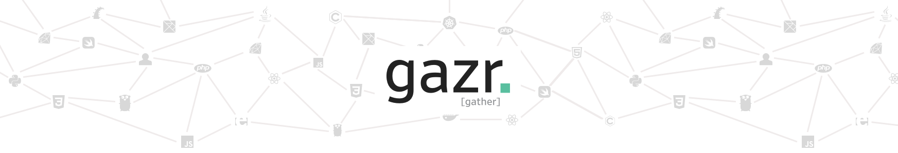

<a href="https://gazr.io"></a>

**gazr**, _pronounced "Gather"_, is an opinionated way to launch **common tasks** on your project. Know more on [https://gazr.io](https://gazr.io).

[See code examples](./examples)

## Story

Developers live in a technological world which is rapidly evolving.
With the move to microservices, they need to constantly switch between projects, technologies, programming languages, frameworks and more.
At dailymotion, we care about the well being of our engineers, as they work over 500+ repositories, developed with more than 50 different technological stacks.
gazr is an approach to deal with the complexity of our codebase.

## Foundation

* A Container runtime as the only dependency on developer's laptop.  
Docker provides a full integration with Mac, Windows & Linux (ubuntu).
* Using generic task names to launch common actions.
* Letting developers use the technologies & libraries they want.
* Simplifying technical on-boarding.
* Simplifying switching between projects.

## Tasks specification through Makefile

```bash
make init
# Bootstrap your application (fetch some data files, make some API calls, request user input etc...)

make style
# Check lint, code styling rules. e.g. pylint, phpcs, eslint, style (java) etc ...

make complexity
# Cyclomatic complexity check (McCabe), radon (python), eslint (js), PHPMD, rules (scala) etc ...

make format
# Format code. e.g Prettier (js), format (golang)

make test
# Shortcut to launch all the test tasks (unit, functional and integration)

make test-unit
# launch unit tests. e.g. pytest, jest, phpunit, JUnit etc...

make test-functional
# launch functional tests. e.g behat, JBehave, Behave, CucumberJS, Cucumber etc...

make test-integration
# launch integration tests. e.g pytest, jest, phpunit etc...

make security
# Shortcut to launch all the security tasks (security-sast, security-dependency-scan)

make security-sast
# launch static application security testing (SAST). e.g Gosec, bandit, Flawfinder, NodeJSScan, phpcs-security-audit, brakeman.

make security-dependency-scan
# launch a dependency scanning to trigger know vulnerabilities. e.g Retire.js, gemnasium, bundler-audit.

make update
# update data according the current version of code (data them self have to know against which latest version code used)

make run
# Locally run the application, e.g. node index.js, python -m myapp, go run myapp etc ...

make watch
# Hot reloading for development.

make build
# Build the application
```

[More details on the website.](https://gazr.io)
